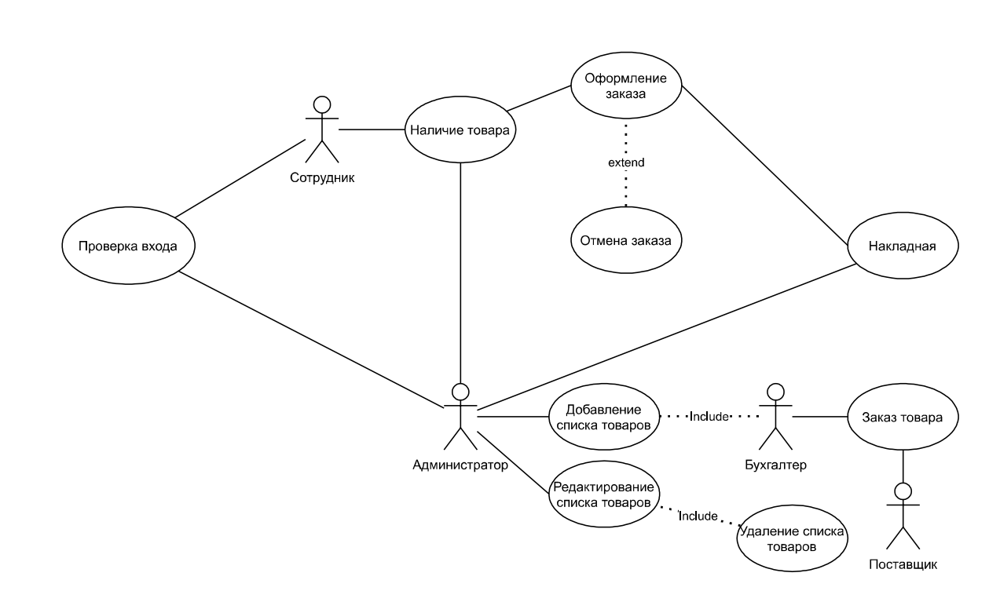
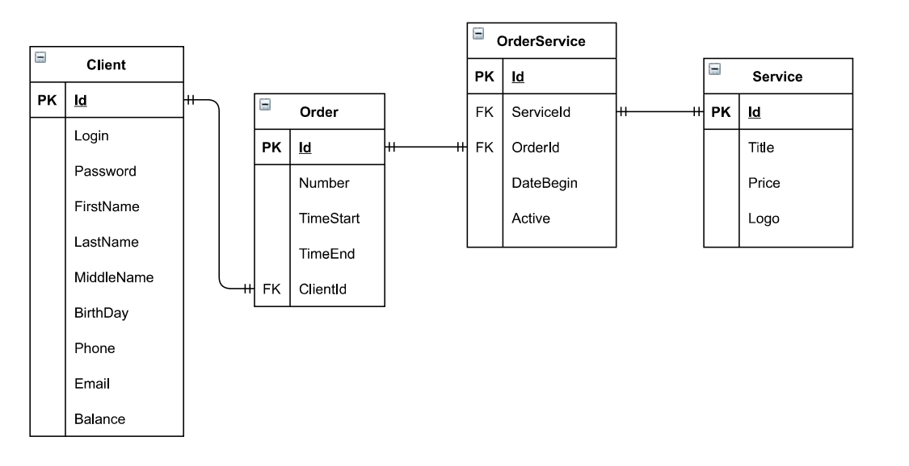
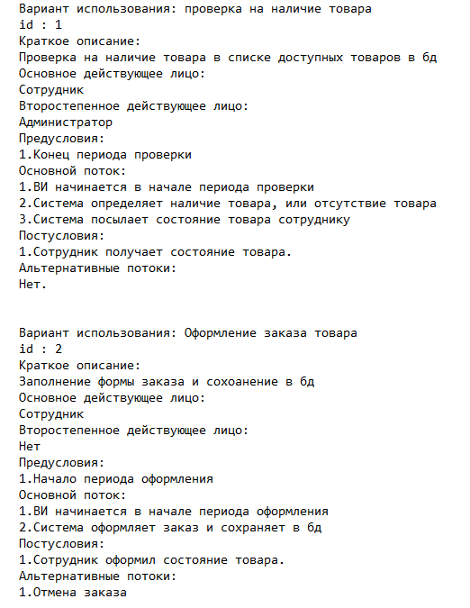
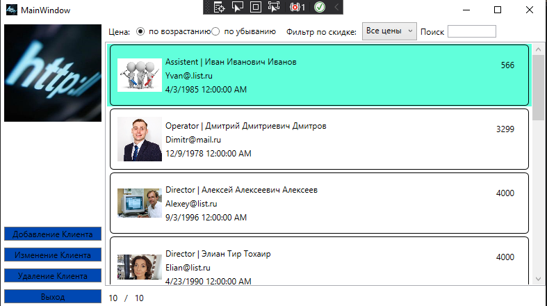
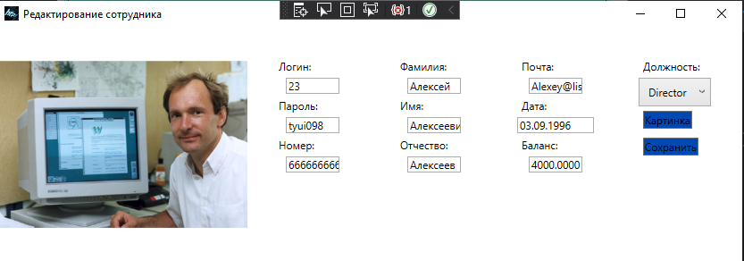

<table style="width: 100%;">
  <tr>
    <td style="text-align: center; border: none;"> 
        Министерство образования и науки РФ <br/>
        ГБПОУ РМЭ "Йошкар-Олинский Технологический колледж 
    </td>
  </tr>
  <tr>
    <td style="text-align: center; border: none; height: 45em;">
        <h2>
            Курсовой проект <br/>
            "Проектирование и разработка информационных систем" <br/>
            для группы И-31
        <h2>
    </td>
  </tr>
  <tr>
    <td style="text-align: right; border: none; height: 20em;">
        <div style="float: right;" align="left">
            <b>Разработал</b>: <br/>
            Новосёлов Кирилл Алексеевич <br/>
            <b>Проверил</b>: <br/>
            Колесников Евгений Иванович
        </div>
    </td>
  </tr>
  <tr>
    <td style="text-align: center; border: none; height: 1em;">
        г.Йошкар-Ола, 2021
    </td>
  </tr>
</table>

<div style="page-break-after: always;"></div>

https://github.com/veronikatoporova/kursovaya

# Содержание

* [Теоретическая часть](#Теоретическая-часть)
* [Практическая часть, разработка бд](#Практическая-часть.-Разработка-БД)
* [Практическая часть, разработка кода ИС](#Практическая-часть.-Разработка-кода-ИС)

# Теоретическая-часть
## Диаграммы

### Предметная область Интернет провайдер.Подсистема работы с товарами.

### Диаграмма Use Case:


### Диаграмма ER:

### Диаграмма Состояний:

### CСпецификация прецентдентов Use Case:



# Практическая часть
## Программирование С#

### Приложение было разработанно в Visual Studio, пример работы программы:
### Главное окно:

#### Прмер кода разметки страницы:
```xml

    <Grid>
        <Grid.ColumnDefinitions>
            <ColumnDefinition Width="150"/>
            <ColumnDefinition Width="1*"/>
        </Grid.ColumnDefinitions>

        <StackPanel VerticalAlignment="Bottom">

            <Label Content="Цена: "/>
            <RadioButton 
                GroupName="Price"
                Tag="1"
                Content="по возрастанию" 
                IsChecked="True" 
                Checked="RadioButton_Checked"
                VerticalContentAlignment="Center"/>
            <RadioButton 
                GroupName="Price" 
                Tag="2"
                Content="по убыванию" 
                Checked="RadioButton_Checked"
                VerticalContentAlignment="Center"/>

            <Label Content="Фильтр по скидке: "
                Margin="10,0,0,0"
                VerticalAlignment="Center"/>
            <ComboBox
                Name="PriceFilterComboBox"
                SelectedIndex="0"
                SelectionChanged="PriceFilterComboBox_SelectionChanged"
                ItemsSource="{Binding FilterByPriceNamesList}"/>

            <Label Content="Поиск"/>
                <TextBox
                    x:Name="SearchFilterTextBox"
                    VerticalAlignment="Center"
                    KeyUp="TextBox_KeyUp"/>
            
            <Button Margin="5" x:Name="OrderProvid" Content="Заказ поставок" Click="OrdProvidClick"></Button>
            <Button Margin="5" x:Name="ExitBtn" Content="Выход" Click="ExitButtonClick"></Button>
        </StackPanel>
        <Image 
        Margin="5"
        Source="./Logo/Logo.jpg" 
        VerticalAlignment="Top"/>
        <ListView
            Grid.Row="1"
            Grid.Column="1"
            ItemsSource="{Binding ProductList}"
            x:Name="ProductListView">
            <ListView.ItemContainerStyle>
                <Style 
                    TargetType="ListViewItem">

                    <Style.Triggers>
                        <DataTrigger
                            Binding="{Binding MinPrice}"
                            Value="True">
                            <Setter
                                Property="Background"
                                Value="Aqua"/>
                        </DataTrigger>
                    </Style.Triggers>
                    <Setter 
                        Property="HorizontalContentAlignment"
                        Value="Stretch" />
                </Style>
            </ListView.ItemContainerStyle>
            <ListView.ItemTemplate>
        <DataTemplate>
            <Border 
                BorderThickness="1" 
                BorderBrush="Black" 
                CornerRadius="5">
                <Grid 
                    Margin="10" 
                    HorizontalAlignment="Stretch">
                    <Grid.ColumnDefinitions>
                        <ColumnDefinition Width="64"/>
                        <ColumnDefinition Width="*"/>
                        <ColumnDefinition Width="100"/>
                    </Grid.ColumnDefinitions>
                    <Image
                        Width="64" 
                        Height="64"
                        Source="{Binding Path=ImagePreview}" />

                    <TextBlock 
                        Text="{Binding PriceString}" 
                        Grid.Column="2" 
                        HorizontalAlignment="Right" 
                        Margin="10"/>

                    <Grid Grid.Column="1" Margin="5">
                        <Grid.RowDefinitions>
                            <RowDefinition Height="20"/>
                            <RowDefinition Height="20"/>
                            <RowDefinition Height="*"/>
                        </Grid.RowDefinitions>

                        <StackPanel
                            Orientation="Horizontal">
                            <TextBlock 
                                Text="{Binding ProductType.Title}"/>
                            <TextBlock 
                                Text=" | "/>
                            <TextBlock 
                                Text="{Binding Title}"/>
                        </StackPanel>

                        <TextBlock 
                            Text="{Binding Storage.Title}" 
                            Grid.Row="1"/>
                            </Grid>
                        </Grid>
            </Border>
        </DataTemplate>
    </ListView.ItemTemplate>
    </ListView>
        <StackPanel 
            Orientation="Horizontal"
            VerticalAlignment="Bottom"
            Grid.Column="1"
            Grid.Row="2">
            <Label Content="{Binding FilteredProductCount}"/>
            <Label Content="/"/>
            <Label Content="{Binding ProductCount}"/>
        </StackPanel>
    </Grid>
```
#### Пример Логики главной страницы:

```cs


namespace InterNetProvider
{
    public partial class Product
    {
        public Uri ImagePreview
        {
            get
            {
                var imageName = System.IO.Path.Combine(Environment.CurrentDirectory, Image ?? "");
                return System.IO.File.Exists(imageName) ? new Uri(imageName) : new Uri("pack://application:,,,/Images/picture.png");
            }
        }

        public string PriceString
        {
            get
            {
                return Price.ToString("#.##");
            }
        }

        public Boolean MinPrice
        {
            get
            {
                return Price < 2000;
            }
        }

        public float PriceFloat
        {
            get
            {
                return Convert.ToSingle(Price);
            }
        }

        public string ProductString
        {
            get
            {
                return Title ?? "";
            }
        }


    }
    public partial class MainWindow : Window, INotifyPropertyChanged
    {
        private List<Product> _ProductList;

        public event PropertyChangedEventHandler PropertyChanged;

        public List<Product> ProductList
        {
            get
            {
                

                var FilteredProductList = _ProductList.FindAll(item =>
                item.PriceFloat >= CurrentPriceFilter.Item1 &&
                item.PriceFloat < CurrentPriceFilter.Item2);


                if (SearchFilter != "")
                    FilteredProductList = FilteredProductList.Where(item =>
                        item.Title.IndexOf(SearchFilter, StringComparison.OrdinalIgnoreCase) != -1 ||
                        item.ProductString.IndexOf(SearchFilter, StringComparison.OrdinalIgnoreCase) != -1).ToList();


                if (SortPriceAscending)
                    return FilteredProductList
                        .OrderBy(item => Double.Parse(item.PriceString))
                        .ToList();
                else
                    return FilteredProductList
                .OrderByDescending(item => Double.Parse(item.PriceString))
                .ToList();
            }
            set
            {
                _ProductList = value;
            }
        }

        public MainWindow()
        {
            InitializeComponent();
            this.DataContext = this;
            ProductList = Core.DB.Product.ToList();
        }

        private void ExitButtonClick(object sender, RoutedEventArgs e)
        {
            Application.Current.Shutdown();
        }
        private void OrdProvidClick(object sender, RoutedEventArgs e)
        {
            var Ord = new Windows.Order();
            Ord.ShowDialog();
        }


        private Boolean _SortPriceAscending = true;
        public Boolean SortPriceAscending
        {
            get { return _SortPriceAscending; }
            set
            {
                _SortPriceAscending = value;
                if (PropertyChanged != null)
                {
                    PropertyChanged(this, new PropertyChangedEventArgs("ProductList"));
                    PropertyChanged(this, new PropertyChangedEventArgs("ServicesCount"));
                    PropertyChanged(this, new PropertyChangedEventArgs("FilteredServicesCount"));

                }
            }
        }

        private void RadioButton_Checked(object sender, RoutedEventArgs e)
        {
            SortPriceAscending = (sender as RadioButton).Tag.ToString() == "1";
        }

        

        private List<Tuple<string, float, float>> FilterByPriceValuesList =
        new List<Tuple<string, float, float>>() {
        Tuple.Create("Все цены", 0f, 100000f),
        Tuple.Create("от 0 до 500", 0f, 500f),
        Tuple.Create("от 500 до 1000", 500f, 1000f),
        Tuple.Create("от 1000 до 1500", 1000f, 1500f),
        Tuple.Create("от 1500 до 2000", 1500f, 2000f),
        Tuple.Create("от 2000 до 2500", 2000f, 2500f)
        };

        public List<string> FilterByPriceNamesList
        {
            get
            {
                return FilterByPriceValuesList
                    .Select(item => item.Item1)
                    .ToList();
            }
        }

        private Tuple<float, float> _CurrentPriceFilter = Tuple.Create(float.MinValue, float.MaxValue);

        public Tuple<float, float> CurrentPriceFilter
        {
            get
            {
                return _CurrentPriceFilter;
            }
            set
            {
                _CurrentPriceFilter = value;
                if (PropertyChanged != null)
                {
                    PropertyChanged(this, new PropertyChangedEventArgs("ProductList"));
                    PropertyChanged(this, new PropertyChangedEventArgs("ServicesCount"));
                    PropertyChanged(this, new PropertyChangedEventArgs("FilteredServicesCount"));

                }
            }
        }

        private void PriceFilterComboBox_SelectionChanged(object sender, SelectionChangedEventArgs e)
        {
            CurrentPriceFilter = Tuple.Create(
                FilterByPriceValuesList[PriceFilterComboBox.SelectedIndex].Item2,
                FilterByPriceValuesList[PriceFilterComboBox.SelectedIndex].Item3
            );
        }


        private string _SearchFilter = "";
        public string SearchFilter
        {
            get { return _SearchFilter; }
            set
            {
                _SearchFilter = value;
                if (PropertyChanged != null)
                {
                    PropertyChanged(this, new PropertyChangedEventArgs("ProductList"));
                    PropertyChanged(this, new PropertyChangedEventArgs("ServicesCount"));
                    PropertyChanged(this, new PropertyChangedEventArgs("FilteredProductCount"));
                }
            }
        }

        private void TextBox_KeyUp(object sender, KeyEventArgs e)
        {
            SearchFilter = SearchFilterTextBox.Text;
        }

        public int ProductCount
        {
            get
            {
                return _ProductList.Count;
            }

        }
        public int FilteredProductCount
        {
            get
            {
                return ProductList.Count;
            }
        }
    }
```
### Окно заказов:

#### Прмер кода разметки страницы заказов:
```xml
<Grid>
        <Grid.RowDefinitions>
            <RowDefinition Height="30"/>
            <RowDefinition Height="1*"/>
        </Grid.RowDefinitions>
        

        <StackPanel VerticalAlignment="Bottom">
            <Button Margin="5" x:Name="CreateOrdBtn" Content="Создание заказа" Click="AddOrder_Click"></Button>
            
        </StackPanel>

        <ListView
            Grid.Row="1"
            Grid.Column="1"
            ItemsSource="{Binding OrderList}"
            x:Name="ProductListView">
            <ListView.ItemContainerStyle>
                <Style 
                    TargetType="ListViewItem">
                    <Setter 
                        Property="HorizontalContentAlignment"
                        Value="Stretch" />
                </Style>
            </ListView.ItemContainerStyle>
            <ListView.ItemTemplate>
                <DataTemplate>
                    <Border 
                BorderThickness="1" 
                BorderBrush="Black" 
                CornerRadius="5">
                        <Grid 
                    Margin="10" 
                    HorizontalAlignment="Stretch">
                            <Grid.ColumnDefinitions>
                                <ColumnDefinition Width="64"/>
                                <ColumnDefinition Width="*"/>
                                <ColumnDefinition Width="100"/>
                            </Grid.ColumnDefinitions>

                            <Image
                        Width="64" 
                        Height="64"
                        Source="{Binding Path=Provider.ImagePre}" />
                            
                            <TextBlock 
                                Text="{Binding TotalString}" 
                                Grid.Column="2" 
                                HorizontalAlignment="Right" 
                                Margin="10"/>
                            <Button Margin="5" x:Name="EditOrdBtn"  Grid.Column="1" Height="30"  Width="120" Content="Изменение Заказа" Click="EditOrder_Click"></Button>
                            <Button Margin="5" x:Name="DelOrdBtn" Grid.Column="1" HorizontalAlignment="Right" Height="30" Width="120" Content="Удаление Заказа" Click="DelOrd_Click"></Button>
                            <Grid Grid.Column="1" Margin="5">
                                <Grid.RowDefinitions>
                                    <RowDefinition Height="20"/>
                                    <RowDefinition Height="20"/>
                                    <RowDefinition Height="*"/>
                                </Grid.RowDefinitions>

                                <StackPanel
                            Orientation="Horizontal">
                                    <TextBlock 
                                Text="{Binding Num}"/>
                                    <TextBlock 
                                Text=" | "/>
                                    <TextBlock 
                                Text="{Binding Provider.Title}"/>
                                </StackPanel>
                                
                                <TextBlock 
                            Text="{Binding Date}" 
                            Grid.Row="1"/>
                                
                            </Grid>
                        </Grid>
                    </Border>
                </DataTemplate>
            </ListView.ItemTemplate>
        </ListView>
    </Grid>
```
#### Пример Логики страницы заказов:

```cs
namespace InterNetProvider
{
    public partial class Provider
    {
        public Uri ImagePre
        {
            get
            {
                var imageName = System.IO.Path.Combine(Environment.CurrentDirectory, Logo ?? "");
                return System.IO.File.Exists(imageName) ? new Uri(imageName) : new Uri("pack://application:,,,/Images/picture.png");
            }
        }
    }

    public partial class ProviderOrder
    {
        public string TotalString
        {
            get
            {
                return Total.ToString("#.##");
            }
        }
    }
}


namespace InterNetProvider.Windows
{

    public partial class Order : Window, INotifyPropertyChanged
    {

        private List<ProviderOrder> _OrderList;

        public event PropertyChangedEventHandler PropertyChanged;

        public List<ProviderOrder> OrderList
        {
            get
            {
                return _OrderList;
            }
            set
            {
                _OrderList = value;
                if (PropertyChanged != null)
                {
                    PropertyChanged(this, new PropertyChangedEventArgs("OrderList"));
                }
            }
        }

        public Order()
        {
            InitializeComponent();
            this.DataContext = this;
            OrderList = Core.DB.ProviderOrder.ToList();
        }


        private void AddOrder_Click(object sender, RoutedEventArgs e)
        {
            var NewOrder = new ProviderOrder();

            var NewOrderWindow = new OrderWindow(NewOrder);
            if ((bool)NewOrderWindow.ShowDialog())
            {
                OrderList = Core.DB.ProviderOrder.ToList();
                PropertyChanged(this, new PropertyChangedEventArgs("FilteredOrderCount"));
                PropertyChanged(this, new PropertyChangedEventArgs("OrderCount"));
            }
        }

        private void EditOrder_Click(object sender, RoutedEventArgs e)
        {
            var SelectedOrder = ProductListView.SelectedItem as ProviderOrder;
            var EditOrderWindow = new OrderWindow(SelectedOrder);
            if ((bool)EditOrderWindow.ShowDialog())
            {
                PropertyChanged(this, new PropertyChangedEventArgs("OrderList"));
            }
        }

        private void DelOrd_Click(object sender, RoutedEventArgs e)
        {
            var item = ProductListView.SelectedItem as ProviderOrder;
            Core.DB.ProviderOrder.Remove(item);
            Core.DB.SaveChanges();
            OrderList = Core.DB.ProviderOrder.ToList();
        }


    }

    
}
```

### Окно добавления и редактирования заказов:

#### Прмер кода разметки страницы редактирования заказов:
```xml
      Title="{Binding WindowName}" Height="450" Width="800">
    <Grid>

        <Grid.ColumnDefinitions>
            <ColumnDefinition Width="auto"/>
            <ColumnDefinition  Width="*"/>
        </Grid.ColumnDefinitions>

        <StackPanel Margin="5" Grid.Column="1">
            <Label Content="Номер заказа"/>
            <TextBox Text="{Binding CurrentOrder.Num}"/>
            <Label Content="Дата заказа"/>
            <TextBox Text="{Binding CurrentOrder.DateTimeText}"/>
            <Label Content="Цена заказа"/>
            <TextBox Text="{Binding CurrentOrder.Total}"/>
            <Label Content="Поставщик"/>
            <ComboBox
                HorizontalAlignment="left"
                ItemsSource="{Binding ProviderList}"
                SelectedItem="{Binding CurrentOrder.Provider}">
                <ComboBox.ItemTemplate>
                    <DataTemplate>
                        <Label Content="{Binding Title}"/>
                    </DataTemplate>
                </ComboBox.ItemTemplate>
            </ComboBox>
            <Button Content="Сохранить" Margin="7" HorizontalAlignment="left" Click="SaveButton"></Button>
        </StackPanel>
    </Grid>
```
#### Пример Логики страницы редактирования заказов:

```cs
namespace InterNetProvider
{
    public partial class Provider
    {
        public string ProvName
        {
            get
            {
                return Title;
            }
        }
    }

    public partial class ProviderOrder
    {
        public string DateTimeText
        {
            get
            {
                return Date.ToString("dd.MM.yyyy hh:mm:ss");
            }
            set
            {
                Regex regex = new Regex(@"(\d+)\.(\d+)\.(\d+)\s+(\d+):(\d+):(\d+)");
                Match match = regex.Match(value);
                if (match.Success)
                {
                    try
                    {
                            Date = new DateTime(
                            Convert.ToInt32(match.Groups[3].Value),
                            Convert.ToInt32(match.Groups[2].Value),
                            Convert.ToInt32(match.Groups[1].Value),
                            Convert.ToInt32(match.Groups[4].Value),
                            Convert.ToInt32(match.Groups[5].Value),
                            Convert.ToInt32(match.Groups[6].Value)
                            );
                    }
                    catch
                    {
                        MessageBox.Show("Не верный формат даты/времени");
                    }
                }
                else
                {
                    MessageBox.Show("Не верный формат даты/времени");
                }
            }
        }
    }

}


namespace InterNetProvider.Windows
{
    public partial class OrderWindow : Window, INotifyPropertyChanged
    {


        public List<Provider> ProviderList { get; set; }
        public ProviderOrder CurrentOrder { get; set; }

        public string WindowName
        {
            get
            {
                return CurrentOrder.Id == 0 ? "Новый заказ" : "Редактирование заказа";
            }
        }

        public OrderWindow(ProviderOrder order)
        {
            InitializeComponent();
            DataContext = this;
            CurrentOrder = order;

            ProviderList = Core.DB.Provider.ToList();
        }

        public event PropertyChangedEventHandler PropertyChanged;
        
        private void SaveButton(object sender, RoutedEventArgs e)
        {
            if (CurrentOrder.Total <= 0)
            {
                MessageBox.Show("Стоимость заказа должна быть больше ноля");
                return;
            }
            if (CurrentOrder.Id == 0)
                Core.DB.ProviderOrder.Add(CurrentOrder);
            try
            {
                Core.DB.SaveChanges();
            }
            catch
            {
            }
            DialogResult = true;
        }

    }
}
```
# Тестировние
## Создание библиотеки классов и Юнит тестов
### Библиотека классов
```cs
namespace InterProviderLibrary
{
    public class Analytics
    {

        public Boolean CheckPrice(int price)
        {
            if (price <= 1500)
            {
                return false;
            }
            else
                return true;
        }

        public int DiscountPrice(int price)
        {
            int sum = ((price / 100)*15) * price;
            return sum;
        }

        public string PriceNotNull(int price)
        {
            if (price <= 0)
            {
                return "Цена не может быть меньше или равна нулю!!!";
            }
            else 
                return "Всё правильно";
        }
    }
}
```
### Юнит тесты (Фантазии хватило только на 4)

```cs
namespace UnitTestProject1
{
    [TestClass]
    public class UnitTestProject1
    {
        static Analytics disk_price;
        [ClassInitialize]
        static public void Init(TestContext tc)
        {
            disk_price = new Analytics();
        }


        //Проверка на размер цены
        [TestMethod]
        public void CheckPrice()
        {
            Assert.IsTrue(disk_price.CheckPrice(2000));
        }


        //Проверка на вычисление цены
        [TestMethod]
        public void DiscountPrice()
        {
            Assert.AreEqual(disk_price.DiscountPrice(100), 1500);
        }


        //Проверка на тип данных
        [TestMethod]
        public void ValidationPrice()
        {
            Assert.IsInstanceOfType(disk_price.DiscountPrice(100),typeof(int));
        }

        //Проверка на нулевую цену
        [TestMethod]
        public void PriceNotNull()
        {
            Assert.AreEqual(disk_price.PriceNotNull(-12), "Цена не может быть меньше или равна нулю!!!");
        }
    }
}
```
## Пример работы юнит тестов:

