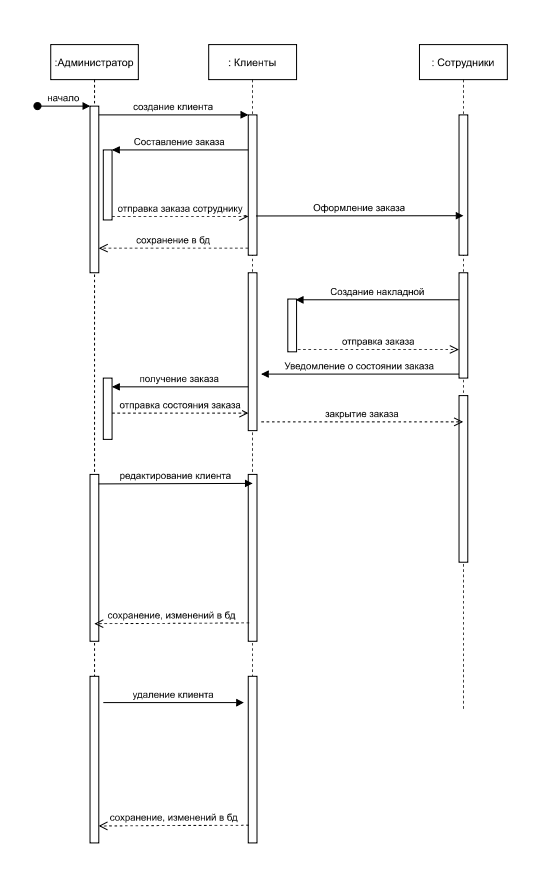

<table style="width: 100%;">
  <tr>
    <td style="text-align: center; border: none;"> 
        Министерство образования и науки РФ <br/>
        ГБПОУ РМЭ "Йошкар-Олинский Технологический колледж 
    </td>
  </tr>
  <tr>
    <td style="text-align: center; border: none; height: 45em;">
        <h2>
            Курсовой проект <br/>
            "Проектирование и разработка информационных систем" <br/>
            для группы И-31
        <h2>
    </td>
  </tr>
  <tr>
    <td style="text-align: right; border: none; height: 20em;">
        <div style="float: right;" align="left">
            <b>Разработал</b>: <br/>
            Топорова Вероника Николаевна <br/>
            <b>Проверил</b>: <br/>
            Колесников Евгений Иванович
        </div>
    </td>
  </tr>
  <tr>
    <td style="text-align: center; border: none; height: 1em;">
        г.Йошкар-Ола, 2021
    </td>
  </tr>
</table>

<div style="page-break-after: always;"></div>

https://github.com/veronikatoporova/kursovaya

# Содержание

* [Теоретическая часть](#Теоретическая-часть)
* [Практическая часть, разработка бд](#Практическая-часть.-Разработка-БД)
* [Практическая часть, разработка кода ИС](#Практическая-часть.-Разработка-кода-ИС)

# Теоретическая-часть
## Диаграммы

### Предметная область Интернет провайдер.Подсистема работы с клиентами.

### Диаграмма Use Case:


### Диаграмма ER:

### Диаграмма Состояний:

### CСпецификация прецентдентов Use Case:


# Практическая часть
## Программирование С#

### Приложение было разработанно в Visual Studio, пример работы программы:
### Главное окно:

#### Прмер кода разметки страницы:
```xml
<Window x:Class="InternetProviderToporova.MainWindow"
        xmlns="http://schemas.microsoft.com/winfx/2006/xaml/presentation"
        xmlns:x="http://schemas.microsoft.com/winfx/2006/xaml"
        xmlns:d="http://schemas.microsoft.com/expression/blend/2008"
        xmlns:mc="http://schemas.openxmlformats.org/markup-compatibility/2006"
        xmlns:local="clr-namespace:InternetProviderToporova"
        mc:Ignorable="d"
        Title="MainWindow" Height="450" Width="800">
    <Grid>
        <Grid.ColumnDefinitions>
            <ColumnDefinition Width="150"/>
            <ColumnDefinition Width="1*"/>
        </Grid.ColumnDefinitions>

        <Image 
        Margin="5"
        Source="./logo/logo.jpg" 
        VerticalAlignment="Top"/>

        <StackPanel  Orientation="Vertical" VerticalAlignment="Bottom">
            <Button 
                Margin="5"
                Content="Добавление Клиента" 
                Name="AddButton" 
                Click="AddButton_Click"/>

            <Button Margin="5" x:Name="EditOrdBtn"  Content="Изменение Клиента" Click="EditOrder_Click"></Button>
            <Button Margin="5" x:Name="DelOrdBtn" Content="Удаление Клиента" Click="DelOrd_Click"></Button>


            <Button 
                Margin="5"
                Content="Выход" 
                Name="ExitButton" 
                Click="ExitButton_Click"/>
        </StackPanel>


        <Grid Grid.Column="1">
            <Grid.RowDefinitions>
                <RowDefinition Height="30"/>
                <RowDefinition Height="1*"/>
                <RowDefinition Height="30"/>
            </Grid.RowDefinitions>

            <StackPanel 
                Orientation="Horizontal" 
                VerticalAlignment="Center">
                <Label Content="Цена: "/>
                <RadioButton 
                    GroupName="Price"
                    Tag="1"
                    Content="по возрастанию" 
                    IsChecked="True" 
                    Checked="RadioButton_Checked"
                    VerticalContentAlignment="Center"/>
                <RadioButton 
                    GroupName="Price" 
                    Tag="2"
                    Content="по убыванию" 
                    Checked="RadioButton_Checked"
                    VerticalContentAlignment="Center"/>

                <Label Content="Фильтр по скидке: "
        Margin="10,0,0,0"
        VerticalAlignment="Center"/>
                <ComboBox
    Name="DiscountFilterComboBox"
    SelectedIndex="0"
    SelectionChanged="DiscountFilterComboBox_SelectionChanged"
    ItemsSource="{Binding FilterByDiscountNamesList}"/>

                <Label Content="Поиск"/>
                <TextBox
                    Width="70"
                    x:Name="SearchFilterTextBox"
                    VerticalAlignment="Center"
                    KeyUp="TextBox_KeyUp"/>
            </StackPanel>

            <ListView
                Grid.Row="1"
                ItemsSource="{Binding ServiceList}"
                x:Name="ProductListView">

                <ListView.ItemContainerStyle>
                    <Style 
                        TargetType="ListViewItem">

                        <Style.Triggers>
                            <DataTrigger
                            Binding="{Binding MaxBalance}"
                            Value="True">
                                <Setter
                                Property="Background"
                                Value="#FF61FFDB"/>
                            </DataTrigger>
                        </Style.Triggers>

                        <Setter 
                            Property="HorizontalContentAlignment"
                            Value="Stretch" />
                    </Style>
                </ListView.ItemContainerStyle>

                <ListView.ItemTemplate>
                    <DataTemplate>
                        <!-- рисуем вокруг элемента границу с загругленными углами -->
                        <Border 
                            BorderThickness="1" 
                            BorderBrush="Black" 
                            CornerRadius="5">
                            <!-- основная "сетка" из 3-х столбцов: картинка, содержимое, цена -->
                            <Grid 
                                Margin="10" 
                                HorizontalAlignment="Stretch">
                                <Grid.ColumnDefinitions>
                                    <ColumnDefinition Width="64"/>
                                    <ColumnDefinition Width="*"/>
                                    <ColumnDefinition Width="100"/>
                                </Grid.ColumnDefinitions>

                                <Image
                                    Width="64" 
                                    Height="64"
                                    Source="{Binding Path=ImagePreview}" />
                                <!-- ,TargetNullValue={StaticResource DefaultImage} -->

                                <TextBlock 
                                    Text="{Binding BalanceString}" 
                                    Grid.Column="2" 
                                    HorizontalAlignment="Right" 
                                    Margin="10"/>


                               
                                <!-- для содержимого рисуем вложенную сетку -->
                                <Grid Grid.Column="1" Margin="5">
                                    <Grid.RowDefinitions>
                                        <RowDefinition Height="20"/>
                                        <RowDefinition Height="20"/>
                                        <RowDefinition Height="*"/>
                                    </Grid.RowDefinitions>

                                    <StackPanel
                                        Orientation="Horizontal">
                                        <TextBlock 
                                            Text="{Binding Role.Title}"/>
                                        <TextBlock 
                                            Text=" | "/>
                                        <TextBlock 
                                            Text="{Binding FullName}"/>
                                    </StackPanel>

                                    <TextBlock 
                                        Text="{Binding Email}" 
                                        Grid.Row="1"/>
                                    <TextBlock 
                                        Text="{Binding BirthDay}" 
                                        Grid.Row="2"/>
                                </Grid>
                            </Grid>
                        </Border>
                    </DataTemplate>
                </ListView.ItemTemplate>

            </ListView>
            <StackPanel 
            Orientation="Horizontal"
            VerticalAlignment="Bottom"
            Grid.Column="1"
            Grid.Row="2">
                <Label Content="{Binding FilteredProductCount}"/>
                <Label Content="/"/>
                <Label Content="{Binding ProductCount}"/>
            </StackPanel>
        </Grid>
    </Grid>
</Window>

```
#### Пример Логики главной страницы:

```cs

namespace InternetProviderToporova
{

    public partial class Client
    {
        public Uri ImagePreview
        {
            get
            {
                var imageName = System.IO.Path.Combine(Environment.CurrentDirectory, Photo ?? "");
                return System.IO.File.Exists(imageName) ? new Uri(imageName) : new Uri("pack://application:,,,/Images/picture.png");
            }
        }

        public string FullName
        {
            get
            {
                return FirstName + " " + LastName + " " + MiddleName;
            }
        }

        public Boolean MaxBalance
        {
            get
            {
                return Balance < 3000;
            }
        }

        public string BalanceString
        {
            get
            {
                // Convert.ToDecimal - преобразует double в decimal
                // Discount ?? 0 - разнуливает "Nullable" переменную
                return Balance.ToString("#.##");
            }
        }

        public float PriceFloat
        {
            get
            {
                return Convert.ToSingle(Balance);
            }
        }

    }

    /// <summary>
    /// Логика взаимодействия для MainWindow.xaml
    /// </summary>
    public partial class MainWindow : Window, INotifyPropertyChanged
    {
        private List<Client> _ServiceList;

        public event PropertyChangedEventHandler PropertyChanged;

        public List<Client> ServiceList
        {
            get
            {
                var FilteredServiceList = _ServiceList.FindAll(item =>
                item.PriceFloat >= CurrentDiscountFilter.Item1 &&
                item.PriceFloat < CurrentDiscountFilter.Item2);

                if (SearchFilter != "")
                    FilteredServiceList = FilteredServiceList.Where(item =>
                        item.FullName.IndexOf(SearchFilter, StringComparison.OrdinalIgnoreCase) != -1 ||
                        item.BalanceString.IndexOf(SearchFilter, StringComparison.OrdinalIgnoreCase) != -1).ToList();

                if (SortPriceAscending)
                    return FilteredServiceList
                    .OrderBy(item => Double.Parse(item.BalanceString))
                .ToList();
                else
                    return FilteredServiceList
                        .OrderByDescending(item => Double.Parse(item.BalanceString))
                        .ToList();
            }
            set {
                _ServiceList = value;
                if (PropertyChanged != null)
                {
                    PropertyChanged(this, new PropertyChangedEventArgs("ServiceList"));
                    PropertyChanged(this, new PropertyChangedEventArgs("ProductCount"));
                    PropertyChanged(this, new PropertyChangedEventArgs("FilteredProductCount"));
                }
            }
        }

        public MainWindow()
        {
            InitializeComponent();
            this.DataContext = this;
            ServiceList = Core.DB.Client.ToList();
        }

            private Boolean _SortPriceAscending = true;
        public Boolean SortPriceAscending
        {
            get { return _SortPriceAscending; }
            set
            {
                _SortPriceAscending = value;
                if (PropertyChanged != null)
                {
                    PropertyChanged(this, new PropertyChangedEventArgs("ServiceList"));
                    PropertyChanged(this, new PropertyChangedEventArgs("ProductCount"));
                    PropertyChanged(this, new PropertyChangedEventArgs("FilteredProductCount"));

                }
            }
        }

        private List<Tuple<string, float, float>> FilterByDiscountValuesList =
        new List<Tuple<string, float, float>>() {
        Tuple.Create("Все цены", 0f, 100000f),
        Tuple.Create("от 0 до 20000", 0f, 20000f),
        Tuple.Create("от 20000 до 40000", 20000f, 40000f),
        Tuple.Create("от 40000 до 60000", 40000f, 60000f)
        };

        public List<string> FilterByDiscountNamesList
        {
            get
            {
                return FilterByDiscountValuesList
                    .Select(item => item.Item1)
                    .ToList();
            }
        }


        private Tuple<float, float> _CurrentDiscountFilter = Tuple.Create(float.MinValue, float.MaxValue);

        public Tuple<float, float> CurrentDiscountFilter
        {
            get
            {
                return _CurrentDiscountFilter;
            }
            set
            {
                _CurrentDiscountFilter = value;
                if (PropertyChanged != null)
                {
                    // при изменении фильтра список перерисовывается
                    PropertyChanged(this, new PropertyChangedEventArgs("ServiceList"));
                    PropertyChanged(this, new PropertyChangedEventArgs("ProductCount"));
                    PropertyChanged(this, new PropertyChangedEventArgs("FilteredProductCount"));

                }
            }
        }

        private void DiscountFilterComboBox_SelectionChanged(object sender, SelectionChangedEventArgs e)
        {
            CurrentDiscountFilter = Tuple.Create(
                FilterByDiscountValuesList[DiscountFilterComboBox.SelectedIndex].Item2,
                FilterByDiscountValuesList[DiscountFilterComboBox.SelectedIndex].Item3
            );
        }


        private string _SearchFilter = "";
        public string SearchFilter
        {
            get { return _SearchFilter; }
            set
            {
                _SearchFilter = value;
                if (PropertyChanged != null)
                {
                    PropertyChanged(this, new PropertyChangedEventArgs("ServiceList"));
                    PropertyChanged(this, new PropertyChangedEventArgs("ServicesCount"));
                    PropertyChanged(this, new PropertyChangedEventArgs("FilteredServiceCount"));
                }
            }
        }

        private void TextBox_KeyUp(object sender, KeyEventArgs e)
        {
            SearchFilter = SearchFilterTextBox.Text;
        }


        public int ProductCount
        {
            get
            {
                return _ServiceList.Count;
            }

        }
        public int FilteredProductCount
        {
            get
            {
                return ServiceList.Count;
            }
        }

        private void RadioButton_Checked(object sender, RoutedEventArgs e)
        {
            SortPriceAscending = (sender as RadioButton).Tag.ToString() == "1";
        }

        private void AddButton_Click(object sender, RoutedEventArgs e)
        {
            var Ord = new Client();
            var NewOrdWind = new CreateWindow(Ord);
            if ((bool)NewOrdWind.ShowDialog())
            {
                ServiceList = Core.DB.Client.ToList();
                PropertyChanged(this, new PropertyChangedEventArgs("ServiceList"));
                PropertyChanged(this, new PropertyChangedEventArgs("FilteredServiceCount"));
                PropertyChanged(this, new PropertyChangedEventArgs("ServiceCount"));
            }
            //Ord.ShowDialog();

        }

        private void ExitButton_Click(object sender, RoutedEventArgs e)
        {
            Application.Current.Shutdown();
        }

        private void DelOrd_Click(object sender, RoutedEventArgs e)
        {
            var item = ProductListView.SelectedItem as Client;
            if (item == null)
            {
                MessageBox.Show("Не выбран клиент");
                return;
            }

            Core.DB.Client.Remove(item);
            Core.DB.SaveChanges();
            ServiceList = Core.DB.Client.ToList();
        }
        

        private void EditOrder_Click(object sender, RoutedEventArgs e)
        {
            var SelectedOrder = ProductListView.SelectedItem as Client;

            if (SelectedOrder == null)
            {
                MessageBox.Show("Не выбран клиент");
                return;
            }

            var EditOrderWindow = new CreateWindow(SelectedOrder);
            if ((bool)EditOrderWindow.ShowDialog())
            {
                PropertyChanged(this, new PropertyChangedEventArgs("ServiceList"));;
            }

        }
    }
}

```


### Окно добавления и редактирования клиентов:

#### Прмер кода разметки страницы редактирования заказов:
```xml
<Window x:Class="InternetProviderToporova.CreateWindow"
        xmlns="http://schemas.microsoft.com/winfx/2006/xaml/presentation"
        xmlns:x="http://schemas.microsoft.com/winfx/2006/xaml"
        xmlns:d="http://schemas.microsoft.com/expression/blend/2008"
        xmlns:mc="http://schemas.openxmlformats.org/markup-compatibility/2006"
        xmlns:local="clr-namespace:InternetProviderToporova"
        mc:Ignorable="d"
        Title="{Binding WindowName}" Height="300" Width="850">
    <Grid>
        <Grid.ColumnDefinitions>
            <ColumnDefinition Width="auto"/>
            <ColumnDefinition  Width="*"/>
        </Grid.ColumnDefinitions>

        <Image 
            
            Height="280" 
            Width="280" 
            Source="{Binding CurrentService.ImagePreview}" />

        <StackPanel Margin="5" Grid.Column="1">
            <Grid>
               
                <Grid.ColumnDefinitions>
                    <ColumnDefinition Width="*"/>
                    <ColumnDefinition Width="*"/>
                    <ColumnDefinition Width="*"/>
                    <ColumnDefinition Width="*"/>
                </Grid.ColumnDefinitions>
                <StackPanel Margin="25" Grid.Column="0" Orientation="Vertical">
                    <Label  Content="Логин:"/>
                    <TextBox Width="60" Text="{Binding CurrentService.Login}"/>
                    <Label Content="Пароль:"/>
                    <TextBox Width="60" Text="{Binding CurrentService.Password}"/>
                    <Label Content="Номер:"/>
                    <TextBox Width="60" Text="{Binding CurrentService.Phone}"/>
                </StackPanel>

                <StackPanel Margin="25" Grid.Column="1" Orientation="Vertical">
                    <Label Content="Фамилия:"/>
                    <TextBox Width="60" Text="{Binding CurrentService.FirstName}"/>
                    <Label Content="Имя:"/>
                    <TextBox Width="60" Text="{Binding CurrentService.LastName}"/>
                    <Label Content="Отчество:"/>
                    <TextBox Width="60" Text="{Binding CurrentService.MiddleName}"/>
                </StackPanel>
                <StackPanel Margin="25" Grid.Column="2" Orientation="Vertical">
                    <Label Content="Почта:"/>
                    <TextBox Width="60" Text="{Binding CurrentService.Email}"/>
                    <Label Content="Дата:"/>
                    <TextBox Text="{Binding CurrentService.StartTimeText}"/>
                    <Label Content="Баланс:"/>
                    <TextBox Width="60" Text="{Binding CurrentService.Balance}"/>
                </StackPanel>
                <StackPanel  Margin="25" Grid.Column="3" Orientation="Vertical">
                    <Label Content="Должность:"/>
                    <ComboBox
                HorizontalAlignment="left"
                ItemsSource="{Binding WorkList}"
                SelectedItem="{Binding CurrentService.Role}">
                        <ComboBox.ItemTemplate>
                            <DataTemplate>
                                <Label Content="{Binding Title}"/>
                            </DataTemplate>
                        </ComboBox.ItemTemplate>
                    </ComboBox>
                    <Button Content="Картинка" Margin="5" HorizontalAlignment="left" Click="GetImageButton_Click"></Button>
                    <Button Content="Сохранить" Margin="5" HorizontalAlignment="left" Click="SaveButton_Click"></Button>
                </StackPanel>
            </Grid>
        </StackPanel>
    </Grid>
</Window>


```
#### Пример Логики страницы редактирования клиентов:

```cs

namespace InternetProviderToporova
{

    public partial class Client
    {
        public string StartTimeText
        {
            get
            {
                return BirthDay.ToString("dd.MM.yyyy");
            }
            set
            {
                Regex regex = new Regex(@"(\d+)\.(\d+)\.(\d+)\s+(\d+):(\d+):(\d+)");
                Match match = regex.Match(value);
                if (match.Success)
                {
                    try
                    {
                        BirthDay = new DateTime(
                            Convert.ToInt32(match.Groups[3].Value),
                            Convert.ToInt32(match.Groups[2].Value),
                            Convert.ToInt32(match.Groups[1].Value),
                            Convert.ToInt32(match.Groups[4].Value),
                            Convert.ToInt32(match.Groups[5].Value),
                            Convert.ToInt32(match.Groups[6].Value)
                            );
                    }
                    catch
                    {
                        MessageBox.Show("Не верный формат даты/времени");
                    }
                }
                else
                {
                    MessageBox.Show("Не верный формат даты/времени");
                }
            }
        }
    }


/// <summary>
/// Логика взаимодействия для CreateWindow.xaml
/// </summary>
public partial class CreateWindow : Window, INotifyPropertyChanged
    {
        public List<Role> WorkList { get; set; }

        public Client CurrentService { get; set; }

        public string WindowName
        {
            get
            {
                return CurrentService.Id == 0 ? "Новый сотрудник" : "Редактирование сотрудника";
            }
        }

        public CreateWindow(Client Sotrudnik)
        {
            InitializeComponent();
            this.DataContext = this;
            CurrentService = Sotrudnik;
            WorkList = Core.DB.Role.ToList();
        }

        private void GetImageButton_Click(object sender, RoutedEventArgs e)
        {
            OpenFileDialog GetImageDialog = new OpenFileDialog();
            GetImageDialog.Filter = "Файлы изображений: (*.png, *.jpg)|*.png;*.jpg";
            GetImageDialog.InitialDirectory = Environment.CurrentDirectory;
            if (GetImageDialog.ShowDialog() == true)
            {
                CurrentService.Photo = GetImageDialog.FileName.Substring(Environment.CurrentDirectory.Length + 1);
                if (PropertyChanged != null)
                {
                    PropertyChanged(this, new PropertyChangedEventArgs("CurrentService"));
                }
            }
        }

        private void SaveButton_Click(object sender, RoutedEventArgs e)
        {
            if (CurrentService.Balance <= 0)
            {
                MessageBox.Show("Стоимость услуги должна быть больше ноля");
                return;
            }

                if (CurrentService.Id == 0)
                Core.DB.Client.Add(CurrentService);
            try
            {
                Core.DB.SaveChanges();
            }
            catch
            {
            }
            DialogResult = true;
        }

        public event PropertyChangedEventHandler PropertyChanged;
    }
}


```
# Тестировние
## Создание библиотеки классов и Юнит тестов
### Библиотека классов
```cs
namespace InterProviderLibrary
{
    public class Analytics
    {

        public Boolean CheckPrice(int price)
        {
            if (price <= 1500)
            {
                return false;
            }
            else
                return true;
        }

        public int DiscountPrice(int price)
        {
            int sum = ((price / 100)*15) * price;
            return sum;
        }

        public string PriceNotNull(int price)
        {
            if (price <= 0)
            {
                return "Цена не может быть меньше или равна нулю!!!";
            }
            else 
                return "Всё правильно";
        }
    }
}
```
### Юнит тесты (Фантазии хватило только на 4)

```cs
namespace UnitTestProject1
{
    [TestClass]
    public class UnitTestProject1
    {
        static Analytics disk_price;
        [ClassInitialize]
        static public void Init(TestContext tc)
        {
            disk_price = new Analytics();
        }


        //Проверка на размер цены
        [TestMethod]
        public void CheckPrice()
        {
            Assert.IsTrue(disk_price.CheckPrice(2000));
        }


        //Проверка на вычисление цены
        [TestMethod]
        public void DiscountPrice()
        {
            Assert.AreEqual(disk_price.DiscountPrice(100), 1500);
        }


        //Проверка на тип данных
        [TestMethod]
        public void ValidationPrice()
        {
            Assert.IsInstanceOfType(disk_price.DiscountPrice(100),typeof(int));
        }

        //Проверка на нулевую цену
        [TestMethod]
        public void PriceNotNull()
        {
            Assert.AreEqual(disk_price.PriceNotNull(-12), "Цена не может быть меньше или равна нулю!!!");
        }
    }
}
```
## Пример работы юнит тестов:

